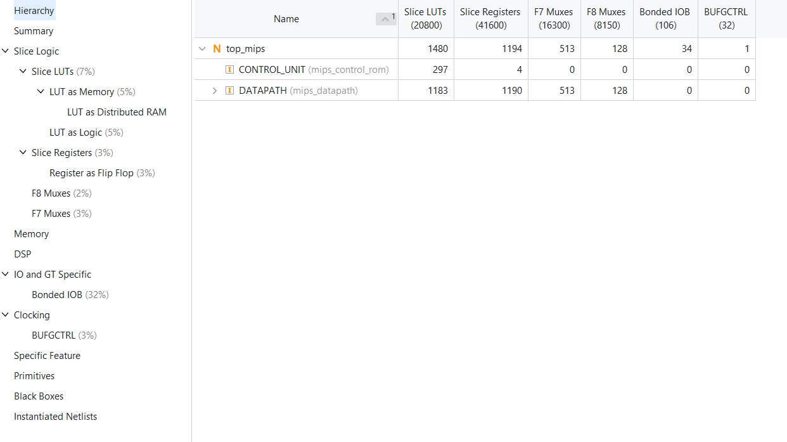

# mips-multicycle-processor
32-bit MIPS Multi-Cycle Processor with ROM-Based Control Unit implemented in Verilog
# 32-bit MIPS Multi-Cycle Processor with ROM-Based Microprogrammed Control

A Verilog HDL implementation of a **32-bit MIPS Multi-Cycle Processor** using a **ROM-based microprogrammed control unit**.

The design is based on the classical multi-cycle MIPS datapath architecture and replaces conventional hardwired control logic with a compact microprogram stored in ROM.

---

## 📌 Project Overview

This project implements a 32-bit MIPS processor in Verilog HDL using a **multi-cycle datapath**.

Unlike a single-cycle processor, where every instruction must complete within one clock cycle, the multi-cycle architecture divides instruction execution into several smaller stages. Datapath resources such as the ALU and memory can therefore be reused across different stages.

The major focus of this project is the implementation of a **ROM-based microprogrammed control unit**.

Instead of generating every control signal through a large combinational FSM, the control unit stores microinstructions in ROM. Each microinstruction contains:

- Datapath control signals
- ALU control information
- PC control information
- Memory control information
- Register-file control information
- A 2-bit sequencing field

The resulting design provides a structured and easily extensible approach to processor control.

---


## ✨ Key Features

- 32-bit MIPS datapath
- Multi-cycle processor architecture
- ROM-based microprogrammed control unit
- 16-bit datapath/control field
- 2-bit microinstruction sequencing field
- 18-bit total ROM word
- Opcode-based microinstruction dispatch
- Separate dispatch mechanisms for instruction classes
- Register file
- ALU
- Program Counter
- Instruction Register
- Memory Data Register
- ALUOut register
- Sign-extension and shift-left logic
- Support for memory, branch, jump and R-type instructions
- RTL simulation using Verilog
- FPGA-oriented RTL implementation

---
## 📚 Instruction Set Supported

| Instruction | Type | Operation |
|---|---|---|
| **LW** | Memory | Load word from memory |
| **SW** | Memory | Store word to memory |
| **ADD** | R-Type | Addition |
| **SUB** | R-Type | Subtraction |
| **BEQ** | Branch | Branch if registers are equal |
| **J** | Jump | Unconditional jump |
## 🧩 Datapath Architecture

The processor is implemented using a **Multicycle MIPS Datapath** based on the
Hennessy–Patterson architecture. The datapath reuses the same hardware
resources across multiple clock cycles to execute different instruction types.
### Datapath Components

The main components of the datapath are:

- **Program Counter (PC)** – Stores the address of the current instruction.
- **Memory** – Used for instruction fetch and data memory operations.
- **Instruction Register (IR)** – Stores the fetched instruction.
- **Register File** – Provides two register operands and supports register write-back.
- **A Register** – Stores the first register-file output.
- **B Register** – Stores the second register-file output.
- **Memory Data Register (MDR)** – Stores data read from memory.
- **ALU** – Performs arithmetic, logical, address calculation, and comparison operations.
- **ALUOut Register** – Stores the intermediate ALU result.
- **Sign-Extend Unit** – Converts the 16-bit immediate into a 32-bit value.
- **Shift-Left-2 Unit** – Shifts the branch offset left by two bits.
- **Multiplexers (MUXes)** – Select the appropriate data sources for the datapath.
- **ALU Control** – Generates the required ALU operation.

## 🧠 ROM-Based Microprogrammed Control Unit

The processor uses a **ROM-based microprogrammed control unit** to generate the control signals required to operate the multi-cycle MIPS datapath. Instead of implementing the control sequence entirely using hardwired combinational logic, the required control signals are stored as microinstructions in ROM. Each microinstruction specifies the datapath operations for a particular processor state, along with a **2-bit sequencing field** that determines how the next microinstruction is selected. The control flow uses sequential execution, return to the Fetch state, and two opcode-based dispatch mechanisms to support the different instruction classes.


 ## 🧠 Control Microprogram

The ROM-based control unit uses a microprogram consisting of **10
microinstructions**. Each microinstruction generates the required
datapath control signals and specifies the sequencing operation.

| Label | ALU Control | SRC1 | SRC2 | Register Control | Memory Control | PCWrite Control | Sequencing |
|---|---|---|---|---|---|---|---|
| **Fetch** | Add | PC | 4 | — | Read PC | ALU | Seq |
| **Decode** | Add | PC | Extshft | Read | — | — | Dispatch 1 |
| **Mem1** | Add | A | Extend | — | — | — | Dispatch 2 |
| **LW2** | — | — | — | — | Read ALU | — | Seq |
| **LW3** | — | — | — | Write MDR | — | — | Fetch |
| **SW2** | — | — | — | — | Write ALU | — | Fetch |
| **Rformat1** | Func code | A | B | — | — | — | Seq |
| **Rformat2** | — | — | — | Write ALU | — | — | Fetch |
| **BEQ1** | Sub | A | B | — | — | ALUOut-cond | Fetch |
| **JUMP1** | — | — | — | — | — | Jump address | Fetch |

## 🚦 Opcode Dispatch

### Dispatch ROM 1

| Opcode | Instruction | Target Microinstruction |
|---|---|---|
| `000000` | R-format | `Rformat1` |
| `000010` | J | `JUMP1` |
| `000100` | BEQ | `BEQ1` |
| `100011` | LW | `Mem1` |
| `101011` | SW | `Mem1` |

### Dispatch ROM 2

| Opcode | Instruction | Target Microinstruction |
|---|---|---|
| `100011` | LW | `LW2` |
| `101011` | SW | `SW2` |
## 🔄 Microinstruction Sequencing

| `Next[1:0]` | Sequencing Operation | Description |
|---|---|---|
| `00` | **SEQ** | Proceed to the next ROM microinstruction |
| `01` | **FETCH** | Return to the Fetch state |
| `10` | **DISPATCH 1** | Use opcode to select an entry from Dispatch ROM 1 |
| `11` | **DISPATCH 2** | Use opcode to select an entry from Dispatch ROM 2 |
## 🧩 Microinstruction Format

Each ROM entry is an **18-bit microinstruction**:

| Field | Width | Purpose |
|---|---:|---|
| Control Field | 16 bits | Generates datapath and control signals |
| Next Field | 2 bits | Determines microinstruction sequencing |
| **Total** | **18 bits** | Complete ROM word |
## Multicycle MIPS — 16-bit Control Word + 2-bit Next-State Field

The control unit uses an **18-bit microinstruction format**, consisting of a **16-bit control field** and a **2-bit next-state field**.

| Opcode | Label | PCW | PCWC | IorD | MR | MW | IRW | MtoR | RW | RDst | A | B[1:0] | PCSrc[1:0] | ALUOp[1:0] | Next[1:0] | 18-bit ROM Word |
|---|---|---:|---:|---:|---:|---:|---:|---:|---:|---:|---:|---:|---:|---:|---:|---|
| — | **Fetch** | 1 | 0 | 0 | 1 | 0 | 1 | 0 | 0 | 0 | 0 | 01 | 00 | 00 | 00 | `100101000001000000` |
| — | **Decode** | 0 | 0 | 0 | 0 | 0 | 0 | 0 | 0 | 0 | 0 | 11 | 00 | 00 | 10 | `000000000011000010` |
| 100011 / 101011 | **Mem1** | 0 | 0 | 0 | 0 | 0 | 0 | 0 | 0 | 0 | 1 | 10 | 00 | 00 | 11 | `000000001110000011` |
| 100011 | **LW2** | 0 | 0 | 1 | 1 | 0 | 0 | 0 | 0 | 0 | 0 | 00 | 00 | 00 | 00 | `001100000000000000` |
| 100011 | **LW3** | 0 | 0 | 0 | 0 | 0 | 0 | 1 | 1 | 0 | 0 | 00 | 00 | 00 | 01 | `000000110000000001` |
| 101011 | **SW2** | 0 | 0 | 1 | 0 | 1 | 0 | 0 | 0 | 0 | 0 | 00 | 00 | 00 | 01 | `001010000000000001` |
| 000000 | **Rformat1** | 0 | 0 | 0 | 0 | 0 | 0 | 0 | 0 | 0 | 1 | 00 | 00 | 10 | 00 | `000000010010001000` |
| 000000 | **Rformat2** | 0 | 0 | 0 | 0 | 0 | 0 | 0 | 1 | 1 | 0 |

## 🛠️ Software & Tools Used

| Tool | Purpose |
|---|---|
| **Verilog HDL** | Hardware description and RTL design |
| **Icarus Verilog** | RTL compilation and simulation |
| **GTKWave** | Simulation waveform analysis |
| **Xilinx Vivado** | RTL synthesis, implementation, and FPGA design analysis |
| **VS Code** | RTL coding and project development |
| **Git & GitHub** | Version control and project hosting |

## Synthesis Results (Artix-7 XC7A35T)

- **Synthesis Tool:** AMD/Xilinx Vivado
- **Target Part:** `xc7a35tcpg236-1`

| Resource | Utilized | Available | Utilization |
|---|---:|---:|---:|
| Slice LUTs | 1,480 | 20,800 | 7% |
| Slice Registers (FFs) | 1,194 | 41,600 | 3% |
| F7 Multiplexers | 513 | 16,300 | 3% |
| F8 Multiplexers | 128 | 8,150 | 2% |
| Bonded IOB | 34 | 106 | 32% |
| BUFGCTRL | 1 | 32 | 3% |

### Vivado Synthesis Utilization

The design was synthesized using AMD/Xilinx Vivado targeting the
Artix-7 `xc7a35tcpg236-1` FPGA. The synthesis report shows that the
processor uses 1,480 Slice LUTs and 1,194 Slice Registers, with
513 F7 multiplexers, 128 F8 multiplexers, 34 bonded I/O blocks, and
1 global clock buffer.


## 📚 Reference

- **David A. Patterson and John L. Hennessy**, *Computer Organization and Design: The Hardware/Software Interface*, MIPS Edition, Morgan Kaufmann.

> The processor architecture and concepts in this project are based on the classical MIPS datapath and control organization described by Patterson and Hennessy.
## 🚀 Future Improvements

| Improvement | Description |
|---|---|
| **More MIPS Instructions** | Extend the processor to support additional MIPS instructions |
| **Pipelined Architecture** | Upgrade the multi-cycle processor to a pipelined MIPS architecture |
| **Cache Memory** | Integrate instruction and data cache memories |
| **Interrupt & Exception Handling** | Add support for processor interrupts and exceptions |
## 📝 Conclusion

This project presents the RTL implementation of a **32-bit MIPS Multi-Cycle Processor** using a **ROM-based microprogrammed control unit**.

The design demonstrates the interaction between the **MIPS instruction set, datapath, memory, ALU, register file, and microprogrammed control logic**. The multi-cycle architecture enables hardware resources to be reused across different instruction execution stages, while the ROM-based control unit provides a structured and extensible method for generating processor control signals.

The processor was designed using **Verilog HDL**, verified through RTL simulation, and targeted for implementation on a **Xilinx Artix-7 FPGA** using **Xilinx Vivado**.

The architectural concepts used in this project are based on the classical MIPS processor organization presented in *Computer Organization and Design: The Hardware/Software Interface* by **David A. Patterson and John L. Hennessy**, a well-known reference in computer architecture. The book uses MIPS as a central example for explaining processor datapaths, control, multi-cycle implementations, and microprogramming.
## 📁 Project Structure

```text
32-bit-multicycle-mips-cpu/
│
├── README.md
│
├── RTL/
│   ├── top_mips.v
│   ├── datapath.v
│   ├── control_rom.v
│   └── memory.v
│
├── Testbench/
│   └── test_b.v
│
├── Simulation/
│   ├── gtk_wave.png
│   ├── simulation_console_log1.png
│   └── simulation_console_log2.png
│
├── Architecture/
│   ├── top_view.png
│   ├── datapath.png
│   ├── control.png
│   ├── control_unit_view.png
│   └── Mips_schematic_design.png
│
└── Results/
    ├── Final_register_value.png
    └── Report_utilization.png
